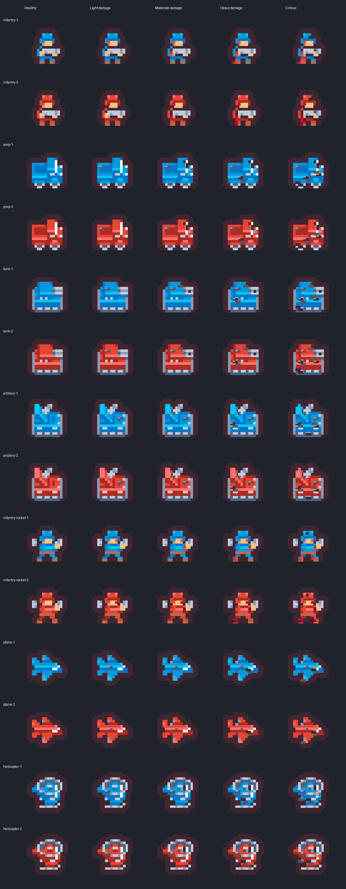

Unit damage art
===============

Each team has four hand-authored damage variants for infantry, jeep, tank, and
artillery, rocket infantry, planes and helicopters, plus matching cropped stat-panel images. The healthy sprites remain
the originals. All variants preserve the original canvas and alpha silhouette.
Infantry wounds progress across the face, arm, and leg, following the reference.
Red infantry uses dark crimson blood so wounds remain visible against its uniform.

Health determines the appearance in five equal bands: above 80% uses the original;
60–80% (excluding 60%) light damage; 40–60% (excluding 40%) moderate;
20–40% (excluding 20%) heavy; 20% or below critical. Healing
automatically restores the appropriate appearance. Factory icons remain healthy.

The pixel rectangles and palette are editable in `scripts/draw-unit-damage.py`.
Regenerate with `python scripts/draw-unit-damage.py` (requires Pillow), then run
`node scripts/sync-assets.js`. Generated base64 assets are committed so ordinary
builds need no Python dependencies. `--stdout` emits a JSON asset map for runtimes
that cannot write directly to the workspace.
