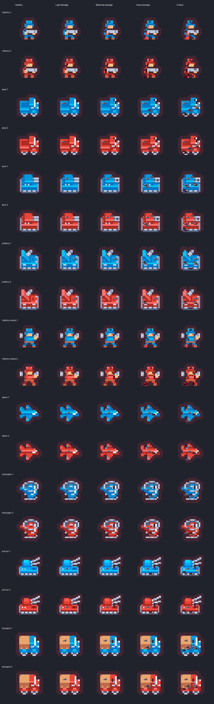

Unit damage art
===============

Each team has four hand-authored damage variants for all ten unit types,
plus matching cropped stat-panel images. The healthy sprites remain
the originals. All variants preserve the original canvas and alpha silhouette.
Infantry wounds progress across the face, arm, and leg, following the reference.
Red infantry uses dark crimson blood so wounds remain visible against its uniform.

Health determines the appearance in five equal bands: above 80% uses the original;
60–80% (excluding 60%) light damage; 40–60% (excluding 40%) moderate;
20–40% (excluding 20%) heavy; 20% or below critical. Healing
automatically restores the appropriate appearance. Factory icons remain healthy.

The pixel rectangles and palette are editable in `scripts/draw-unit-damage.py`.
Regenerate the nine bitmap-based unit types with `python scripts/draw-unit-damage.py`
(requires Pillow). For snipers, edit the healthy vectors in `assets/units/` and run
`node scripts/export-sniper-sprites.mjs` with Playwright Chromium installed.
The exporter adds the damage stages and refreshes the [sniper contact sheet](sniper-damage-variants.png).

Transport originals come from `assets/units/transport-1.svg` and `transport-2.svg`.
Run `node scripts/export-transport-sprites.mjs` to export their native pixels without
smoothing, then `python scripts/draw-unit-damage.py --only transport` for the four
damage stages and cropped previews. This preserves the supplied team colors and layout.

Then run `node --experimental-strip-types scripts/sync-assets.ts`. Generated Base64 assets are committed so ordinary
builds need no Python dependencies. `--stdout` emits a JSON asset map for runtimes
that cannot write directly to the workspace.
