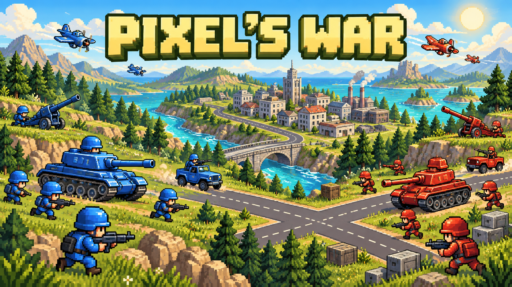

# Pixel’s War



**Capture cities. Build your army. Outsmart the AI or a friend.**

A pixel-art, turn-based strategy game for desktop and mobile. Choose your battlefield,
secure its economy and combine infantry, armor and air power to win.

**[Play in your browser](https://pixelswar.io/)** · No installation required


- **15 battlefields:** roads, forests, mountain positions and narrow water crossings, ordered from smallest to largest by tile count.
- **9 unit types:** capture with infantry, cover advances with artillery and contest the skies.
- **4 AI difficulties:** Easy, Medium, Hard and Expert, or local two-player battles on one device.
- **Online duels:** invite a friend on another device through a direct WebRTC connection.
- **Desktop and mobile:** keyboard, mouse and touch controls, with a zoomable battlefield and an interactive minimap.
- **English, French and German:** language, audio and keyboard settings in Options and help.


Side roads connect the outlying buildings on Are We There Yet?, Nice View Up Here
and The Other Bank. Several smaller maps also feature secondary routes
and corner ponds, with asymmetric shorelines on A Little Stroll and After You.

Two river maps offer narrow grass crossings instead of bridges: **Not the Shoes!**
(10 × 8, small) and **Which Way Across?** (12 × 12, medium). Both banks remain
accessible to ground units, with two crossings to defend or contest.

## How to play

Destroy every opposing unit to win. During your turn, you can move and use the
available actions of **all your units**, in any order. End the turn when finished.
Blue plays first; in AI matches, the AI commands blue and you command red.
The same team-colored transition announces both players’ turns, including the AI.
AI actions begin after its transition finishes.

Select a unit, then click or tap a dot-marked cell to move there, or an
eligible enemy to attack. Confirm finishes the selection; cancel restores movement
to the last committed position. Attacking or capturing commits that position,
so cancelling cannot undo those actions.

### Controls and battlefield feedback

- **Move:** select a unit, then click or tap a reachable dot. The unit follows the cheapest legal path.
- **Enemy inspection:** select an enemy to see its current attack range as stripes and its remaining movement as dots. Terrain costs and occupied cells constrain movement; the preview does not move the enemy.
- **Camera:** drag to pan, use the mouse wheel over the map or pinch to zoom. The overview button fits the map,
  and the always-visible minimap lets you reposition the camera.
- **Tile details:** select a tile and open its thumbnail in the action bar. Statistics appear in a dialog on desktop and mobile.
- **Unit indicators:** the heart and damaged sprite show health. Bottom-left bullets show attacks, the bottom-right
  fuel icon shows movement, and infantry's top-right flag shows capture availability. Spent indicators fade together.
- **Turn changes:** both players get the same team-colored transition. During AI or remote turns, the camera follows
  the active unit and the action bar is hidden without resizing the battlefield.
- **Idle animations:** infantry glance back for two seconds after a fresh random wait of 12–24 seconds, aircraft hover gently and water ripples shimmer. Ground vehicles stay still. Only the sprite moves, keeping status indicators in their corners.
- **Options:** change language, sound, music, board animations and keyboard layout, restart a local/AI match, or choose another map. The animation setting is saved locally in the existing preferences cookie.

| Action           | Keyboard                                      |
| ---------------- | --------------------------------------------- |
| Move             | Arrow keys or the selected ZQSD / WASD layout |
| Confirm          | Enter                                         |
| Cancel / close   | Escape                                        |
| Capture / secure | Space                                         |

All action buttons have accessible labels. Reduced-motion mode keeps spent resource indicators dimmed
and uses a static turn announcement. It also disables idle sprite and water animations. The Animations switch controls these ambient effects, while combat and status feedback remain available. Damage, healing and income also have floating feedback on the map.

### Play with a friend online

Choose a map, then **Play 1v1 online**:

1. The host creates an invitation and sends its link to a friend.
2. The friend opens the link and clicks **Join**. The connection is automatic; there is no response code to send back.
3. The host commands blue and plays first; the guest commands red.

Keep both game pages open. A temporary connection loss pauses play and reconnecting
resynchronizes the match. Closing or refreshing either page ends the session;
matches are not saved. After victory, both players must agree to a rematch.

The browsers exchange game data through WebRTC, directly or through a TURN relay. The host validates
actions and supplies the shared game state. This is intended for friends: the host
can technically alter that state. No account or game server is required.
[PeerJS Cloud](https://peerjs.com/server/cloud) exchanges the connection details
automatically. When configured, Metered supplies STUN/TURN servers so WebRTC can
use a relay when a direct path is unavailable. Without Metered settings, development
uses Google's public STUN service only. Creating or joining contacts these services,
but browsing maps or opening an invitation does not. Network restrictions, provider
outages and exhausted relay quotas can still prevent connections.

The invitation contains a random session identifier, map and game fingerprint;
it no longer contains the full WebRTC session description. Share it only with your
opponent. A session accepts one guest, and expired, occupied or incompatible
invitations show a recoverable error. Existing manual `PW1` invitations must be recreated.

The [terms, privacy and cookies page](https://pixelswar.io/terms/)
explains session cookies, third-party services and connection limits in all three
languages. The invitation screen focuses on creating or joining a game.

Use the published site when inviting someone on another device. A development
link containing `127.0.0.1` points to the recipient's own computer.

### Buildings and economy

All three infantry types can capture and secure buildings. Buildings have 20
capture points, and a capture removes 10. Each infantry unit can capture once per
turn, so two units can finish a capture together. Securing a building you already
own restores all its capture points in one action.

| Building  | Benefit                                                                              |
| --------- | ------------------------------------------------------------------------------------ |
| City      | Adds 200$ at the start of each owner's turn                                          |
| Oil field | Adds 300$ at the start of each owner's turn                                          |
| Hospital  | Heals a friendly unit standing on it by up to 50 HP at the start of the owner's turn |
| Army base | Produces ground units                                                                |
| Airport   | Produces helicopters and planes                                                      |

Neutral oil fields form contested central objectives on maps 1, 3, 8, 11 and 12
(respectively 1, 2, 2, 3 and 4 fields). Ten replace cities and two occupy former
grass cells; roads, crossings and starting armies are unchanged.

Healing never exceeds maximum health; a floating label shows the HP actually
recovered at the start of the turn. To buy a unit, you must own the production
building, leave its cell empty and have enough money. New units can act immediately.

### Units

Movement is a points budget, not a number of cells. Attack and defense are inputs
to the damage formula below; attack is not the final damage dealt.

| Unit       |  Cost |  HP | Movement | Attacks / turn | Attack | Defense | Range |
| ---------- | ----: | --: | -------: | -------------: | -----: | ------: | ----- |
| Infantry   |  200$ | 100 |        5 |              2 |     40 |      10 | 1     |
| Rocket     |  400$ | 100 |        4 |              1 |     40 |      10 | 1     |
| Sniper     |  500$ | 100 |        4 |              1 |     60 |      10 | 2–3   |
| Jeep       |  600$ | 125 |        8 |              2 |     50 |      20 | 1     |
| Tank       | 1200$ | 180 |        6 |              2 |     70 |      40 | 1     |
| Artillery  | 1600$ | 120 |        4 |              1 |     60 |      30 | 3–4   |
| Anti-air   | 1000$ | 120 |        6 |              2 |     70 |      30 | 1–2   |
| Helicopter | 1800$ | 110 |        8 |              1 |     65 |      15 | 1     |
| Plane      | 3000$ | 120 |       10 |              1 |     80 |      25 | 1     |

Infantry captures objectives. Rockets counter vehicles; snipers counter infantry.
Jeeps are fast and effective against infantry, while tanks combine armor and two
attacks. Artillery softens ground targets from a distance, but cannot fire at
cells one or two steps away. Anti-air attacks only flying units. Helicopters hunt infantry;
planes can attack both ground and air units. Other ground units cannot target
flying units.

### Terrain and range

Movement is orthogonal and pays the destination cell's cost. One unit occupies a
cell at a time. Attack ranges are square, including diagonals.

| Terrain  | Ground movement cost | Defense |
| -------- | -------------------: | ------: |
| Road     |                    1 |       0 |
| Grass    |                    2 |       0 |
| Building |                    2 |      40 |
| Forest   |                    3 |      30 |
| Mountain |                    4 |      50 |
| Water    |           Impassable |       0 |

Flying units spend 1 movement point per cell regardless of terrain, and receive
no terrain defense. There are no playable naval units yet.

Ranged ground units on a mountain gain **+1 maximum range**, keeping their minimum
range: sniper 2–4, artillery 3–5, anti-air 1–3. Melee and flying units gain no range.

On grass, infantry can cross two cells per turn, tanks three and jeeps four.
Roads stretch these distances; forests and mountains shorten them.

### Combat and artillery balance

Damage is calculated before rounding the defender's remaining health:

```text
base damage = max(0, attack − (unit defense + terrain defense) / 10)
damage = base damage × (attacker HP / attacker maximum HP) × matchup multiplier
remaining HP = max(0, round(defender HP − damage))
```

A surviving defender retaliates if its own range and matchup allow it. Retaliation
uses its remaining health and does not spend an attack point. Snipers and artillery
cannot retaliate at contact. A forbidden matchup cannot be selected as a target.

A full-health artillery shot against a full-health target on grass or road gives:

| Target                     | Matchup multiplier | Starting HP | Remaining HP |
| -------------------------- | -----------------: | ----------: | -----------: |
| Infantry, Rocket or Sniper |              ×1.35 |         100 |       **20** |
| Jeep                       |              ×1.45 |         125 |       **41** |
| Anti-air                   |              ×1.25 |         120 |       **49** |
| Tank                       |              ×1.60 |         180 |       **90** |
| Artillery                  |              ×1.00 |         120 |       **63** |

All infantry types take the same artillery damage under the same conditions.
Terrain protection and damage to the attacker reduce these losses. Artillery
cannot destroy any of these full-health targets with one shot; its single attack,
price and adjacent blind spot leave room for faster units to close in.

Against full-health artillery on grass or road, full-health basic infantry deals
30 HP per attack, leaving 60 of its 120 HP after two attacks. Rocket infantry deals
80 HP in one attack, leaving 40 HP. Their respective matchup multipliers are ×0.8
and ×2.15. Terrain cover and injured attackers reduce these losses.

The complete matchup table lives in [combat-rules.ts](src/lib/game/combat-rules.ts).
Unit and terrain statistics live in [catalog.ts](src/lib/game/catalog.ts).

### AI opponents

Easy, Medium, Hard and Expert use the same units, budgets and rules as the player.
Higher levels improve targeting, positioning and purchases. Expert also evaluates
short sequences of future actions and economic opportunities; it is a bounded
search, not an exhaustive solution of the game.

See [AI rules and implementation notes](docs/ai.md) for each difficulty's behavior.

## Development

Built with **SvelteKit 2, Svelte 5 runes and Paraglide**. Requires Node.js 22.14 or newer:

```sh
npm ci
npm run dev
```

Open the Vite address. The home route is `/`; games use `/play/1/` through
`/play/15/`. Add `?ai=easy`, `?ai=medium`, `?ai=hard` or `?ai=expert`
to play against the AI, or `?online=1` for online setup. Without either parameter,
the game is local two-player.

```sh
npm run check
npm run format:check
npm test
npm run build
npm run preview
```

The production site is generated in `build/`; serve it over HTTP.
After changing a map or its sprites, run `npm run generate:map-previews` with the dev server running.
This refreshes the static thumbnails and their dimension/size metadata. Set `PREVIEW_BASE_URL`
if the server uses an address other than `http://127.0.0.1:5173`.
`npm run check` generates Paraglide messages and declarations before checking
Svelte. `npm run generate:i18n` runs generation separately. Both generation and
Vite use `paraglide.config.js`; generated `src/lib/paraglide/` files are ignored.

### Browser tests

```sh
node node_modules/@playwright/test/cli.js install chromium
npm run build
npm run test:e2e
```

Playwright covers desktop/mobile play, map navigation, movement, combat, capture,
economy, settings, minimaps, AI and real WebRTC matches between two browser contexts.
Online browser tests start a real local PeerServer and use local ICE candidates;
they do not depend on the public signaling service or verify connectivity across
different internet connections. Their browser contexts bypass CSP only to allow
the temporary local signaling port. Production CSP allows the PeerJS Cloud
WebSocket endpoint explicitly. To use installed Chrome, set
`PW_CHANNEL=chrome` (PowerShell: `$env:PW_CHANNEL = 'chrome'`).

### Project layout

| Location                                     | Responsibility                                           |
| -------------------------------------------- | -------------------------------------------------------- |
| `src/routes/`                                | Map selection and game routes                            |
| `src/lib/components/`                        | Board, controls, stats, dialogs and other UI             |
| `src/lib/game/game.svelte.ts`, `model.ts`    | Per-game state and rule queries                          |
| `src/lib/game/actions.ts`, `controller.ts`   | Actions, input and asynchronous combat                   |
| `src/lib/game/catalog.ts`, `combat-rules.ts` | Statistics, terrain, attack geometry and damage          |
| `src/lib/game/ai*.ts`, `expert-ai.ts`        | AI decisions, economy and bounded lookahead              |
| `src/lib/game/peer.ts`, `online.ts`          | WebRTC invitations, authoritative commands and snapshots |
| `src/lib/data/board-N.json`                  | Explicit, editable map layouts                           |
| `messages/`                                  | English, French and German source translations           |
| `assets/`, `src/lib/app.css`                 | Artwork/audio sources, global styles and sprite mappings |
| `distribution/itch/`                         | itch.io launcher source and bundled fonts                |
| `docs/`                                      | Screenshots, cover artwork and technical guides          |
| `scripts/`                                   | Asset generation and connectivity checks                 |
| `tests/`                                     | Node rule tests and Playwright browser tests             |

Components use Svelte runes. Each game owns its state; navigation disposes pending
combat and audio. The DOM displays state rather than storing game rules. Board
measurements control scrolling, focus and minimap positioning.

Online peers check a fingerprint of the map, unit statistics, terrain and protocol
version before connecting. Bump `protocolVersion` in `peer.ts` when changing command
semantics or combat rules so incompatible clients cannot start a match together.

To add a unit, extend the catalog, provide sprites and translations, and define
non-neutral matchups. Production menus enumerate the catalog automatically.

Use tabs, single quotes, no JavaScript semicolons and no trailing commas. Keep
Svelte script, markup and style sections distinct. Nest CSS variants and relevant
media queries under their selector, with blank lines between rules.
Use descriptive function and parameter names, such as `revealCell`, `attackerType` and `damageDealt`.
Avoid single-letter placeholders for game entities. Coordinate properties `x` and `y` keep their standard meaning.
Run `npm run format` before committing. CI checks formatting.

### Assets

Assets include SVGs, original audio and bitmap sources stored as `.png.base64`
or `.gif.base64`. Prepare, predev and prebuild synchronize these into ignored
`static/assets/`, decoding Base64 files and copying other sources. Native image
files take precedence over their Base64 equivalents. The favicon is generated
from `favicon.png.base64`.

Visual assets are preloaded when entering a game and reused across map navigation.
To refresh generated assets after editing sources:

```sh
node --experimental-strip-types scripts/sync-assets.ts
```

All nine unit types have a healthy sprite and four damage stages for both teams.
See [asset sources and regeneration](assets/README.md) and [unit damage artwork](docs/unit-damage.md).
Sprite generators write Base64 sources without redundant PNG copies. Synchronization removes stale
public files when their source is removed. Do not commit generated static assets.

### itch.io launcher and artwork

The itch.io upload is a small launcher, not a second game build. It opens the current GitHub Pages game.
See [launcher packaging and upload instructions](distribution/itch/README.md). The ready-to-upload archive
is `distribution/itch.zip`, with `index.html` at its root and the same locally bundled fonts as the game.

The [wide banner](docs/artwork/pixels-war-banner.png), [650 × 500 cover](docs/artwork/pixels-war-cover-650x500.png)
and [generation prompts](docs/artwork/cover-prompt.md) live in `docs/artwork/`. Temporary exports belong in
ignored `output/` or `tmp/` folders. Browser traces and verification screenshots belong in ignored `test-results/`.

## GitHub Pages deployment

### Metered TURN setup

Create a TURN credential in the Metered dashboard. Copy `.env.example` to `.env.local`
and set `VITE_METERED_APP` to the app name (or its `.metered.live` hostname) and
`VITE_METERED_TURN_API_KEY` to that credential's API key. Restart Vite after changes.
Use the credential-scoped key, **never the account Secret Key or Project API Key**.
This integration needs no additional SDK or backend. See the
[Metered TURN reference](https://www.metered.ca/docs/llms-turn-server.txt).

The browser retrieves ICE servers when creating or joining a game. It keeps the
provider's UDP, TCP and TLS endpoints, so the dashboard controls the available
relay region. A failed credential request shows an error instead of silently
turning the relay off. Keep the credential enabled and valid throughout your tests.

In GitHub **Settings → Secrets and variables → Actions**, add:

| Type                | Name                   | Value                          |
| ------------------- | ---------------------- | ------------------------------ |
| Repository variable | `METERED_APP`          | Metered app name or hostname   |
| Repository secret   | `METERED_TURN_API_KEY` | Credential-scoped TURN API key |

The workflow passes these values to Vite at build time. `.env` files on your PC
are not uploaded by Git. The Pages workflow stops if either setting is missing.
The TURN key is intentionally included in the public
browser bundle, even when supplied through a GitHub secret. Anyone can extract
and use the relay credential, so monitor its quota and revoke/replace it if abused.
For wider distribution, consider issuing rotating credentials from a backend.

For a local connectivity check, run `npm run test:turn`. It uses the `.env` values
and two browser peers forced through TURN, exchanges a small payload and verifies
the selected relay candidates. It consumes a small amount of relay bandwidth.
Alternatively, set `VITE_TURN_RELAY_ONLY=true` locally and restart Vite to test a
full game through TURN. Keep it `false` for normal play to allow direct connections.
Provider quotas and credential expiry can interrupt or prevent relayed games.

### Publish the site

1. In **Settings → Pages**, choose **GitHub Actions** as the source.
2. In **Actions → Deploy GitHub Pages → Run workflow**, select the branch to publish.

The manual workflow builds with an empty `BASE_PATH` for the custom domain
`https://pixelswar.io/` and publishes the generated `build/` artifact. Keep
`pixelswar.io` configured as the custom domain in **Settings → Pages**.
Publishing the source branch instead can display the README rather than the app.

To test the production base path in PowerShell:

```powershell
$env:BASE_PATH = ''
npm run build
Remove-Item Env:BASE_PATH
```

CI checks formatting, components, rules, the build and browser behavior separately.
Pushing or merging does not automatically deploy the site.

### Create and submit a map

Open the map editor from the homepage, or run `npm run map:editor` and open
http://127.0.0.1:5182/ for local editing. The editor shares the game’s language preference (English, French or German).
Paint terrain and buildings with the game's sprites, place both armies, and download
a JSON file ready for integration. Roads and shores connect automatically. Existing
maps and JSON files can be imported; the current draft is saved locally in the browser.
The editor is included in development and production builds. Submit your JSON in a
[GitHub issue](https://github.com/john-does-it/pixelswars/issues/new), with a name,
description and optional screenshot.
Maps are reviewed before publication. See the [editor guide](tools/map-editor/README.md).

## Credits

Programming: [John Does it](https://johndoesit.be).
Sprites: [Kenney](https://www.kenney.nl).
Cover and banner: AI-generated promotional artwork. See [prompts](docs/artwork/cover-prompt.md).
Typography: [Pixelify Sans](https://github.com/google/fonts/tree/main/ofl/pixelifysans), hosted locally under the [SIL Open Font License](src/lib/fonts/OFL.txt).
Body text and controls: [IBM Plex Mono](https://github.com/google/fonts/tree/main/ofl/ibmplexmono), hosted locally under the [SIL Open Font License](src/lib/fonts/ibm-plex-mono/OFL.txt).
Sounds: [Pixabay](https://pixabay.com/fr/sound-effects).
Music: [Monolith](https://arcofdream.bandcamp.com/album/monolith-official-soundtrack).
QA: Gauthier Miessen.

Feedback and contributions: [GitHub issues](https://github.com/john-does-it/pixelswars/issues).
